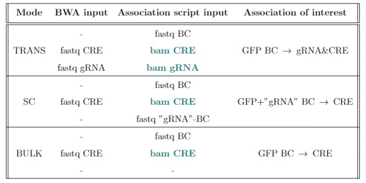

# MPRA_lib_python

# Sequencing Analysis Pipeline

This is an internal pipeline for the sequencing analysis of the data obtained from MPRA experiments (transMPRA/scMPRA/bulkMPRA) based on the following workflow:

<p align="center">
  
</p>

## Directory Structure

- `results/`: This directory will store the results locally (output CSV file with counts, Rmarkdown output)
- `data/`: You can add locally your data in this directory if you want or specify full paths otherwise
- `data/example_data`: This directory contains small example data extracted from the real experiments, as well as the corresponding reference files
- `scripts/`: This directory contains Python and R files for processing


# Installation

1. Clone this repository:
```shell
git clone git@github.com:veltenlab/MPRA_lib_python.git
```
2. Change directory to the repository: `cd MPRA_lib_python`
3. Install the conda environment. It is recommended to use [mamba](https://mamba.readthedocs.io/en/latest/index.html) or [miniconda](https://docs.anaconda.com/miniconda/miniconda-install/)

```shell
conda env create -n MPRA_env -f MPRA_env.yaml 
```
4. Activate the environment: `conda activate MPRA_env`

## Configuration

The pipeline is applicable for 3 modes: TRANS, SC and BULK, which need to be specified in the config file prior to running the pipeline. Additionally, full paths to the FASTQ files must be provided in the config file.

## Quick start: Configuration

Before running a snakefile, config.yaml file has to be customized:
- choose the type of the performed MPRA experiment (trans/sc/bulk)
- add data paths for sequencing data
- adjust the number of threads used for alignment

## Test

You can test the `snakefile` using the provided `config_test.yaml` and example data to ensure that the workflow runs correctly in your environment.

1. **Prepare the Environment**  
   Ensure that all dependencies are installed as outlined in the [Installation](#installation) section.

2. **Locate Test Files**  
   The test configuration file `config_test.yaml` and the example data are included in the repository.
   You can choose the mode you want to test by adjust config_test file, see details inside of it.

3. **Run the Test**  
   Execute the Snakemake workflow with the test configuration by running the following command in your terminal:

   ```bash
   snakemake --configfile config_test.yaml --cores 1 --use-conda


